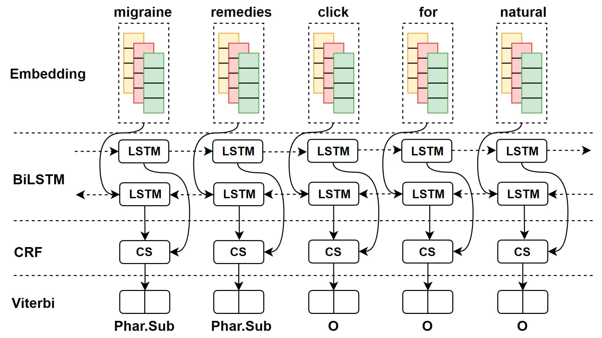
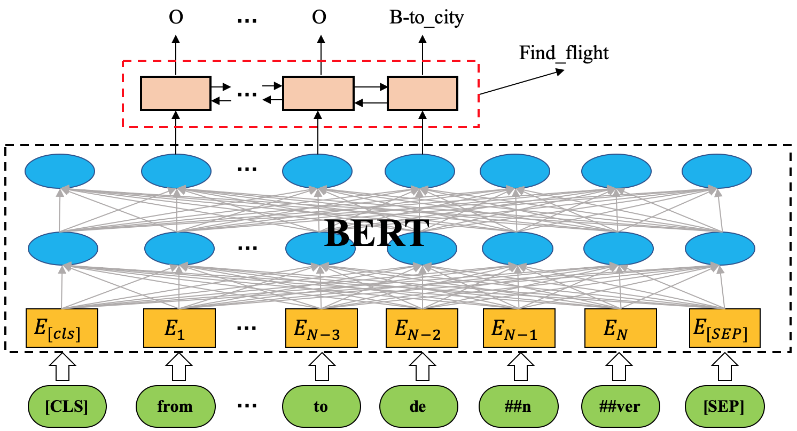

# sequence-labeling-models  

## Experiments

## BiLSTM CRF

## Bert CRF

## Bert + External Features + CRF

- Bert 层

Bert 在模型当中用作一个编码层，主要负责将核心语义信息添加到进行编码，然后输出一个具备丰富上下文语义的隐藏层特征向量。

- External 层

可以融合外部知识，将`POS`，`NER`信息融入到序列标注的任务当中，然后将其进行深度融合。这些信息融合的方式也是可以对其进行深入检索。

- CRF 层

作为一个目前常用且高效的序列信息解码层，能够在全局获得最佳预测效果。
